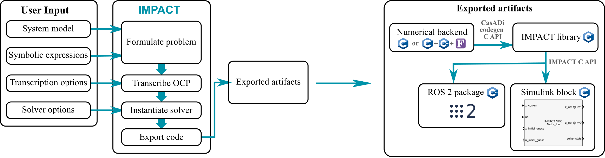

[Registration](#registration){: .btn .btn-primary .d-lg-inline-block my-lg-0 .mt-1}
[Important dates](#important-dates){: .btn .btn-primary .d-lg-inline-block my-lg-0 my-2 mx-lg-2 .mt-1}
[Organizers](#organizers){: .btn .btn-primary .d-lg-inline-block my-lg-0 my-2 mx-lg-2 .mt-1}
[Contact](#contact){: .btn .btn-primary .d-lg-inline-block my-lg-0 .mt-1} 
 
[Relevant repositories](#relevant-repositories){: .btn .btn-primary .d-lg-inline-block my-lg-0 .mt-1}
[Program](#program){: .btn .btn-primary .d-lg-inline-block my-lg-0 .mt-1}
[Venue](#venue){: .btn .btn-primary .d-lg-inline-block my-lg-0 my-2 mx-lg-2 .mt-1}

***

### Overview

In this workshop, participants will engage in hands-on exploration of model predictive control applied to mechatronic systems. By engaging with cutting-edge tools and techniques, participants will develop the skills necessary to configure and deploy model predictive controllers on real hardware.

To streamline the guided exercises, the workshop makes use of the free and open-source [Rockit](https://gitlab.kuleuven.be/meco-software/rockit) [1] and [Impact](https://gitlab.kuleuven.be/meco-software/impact) [2][3] software frameworks developed by the [MECO Research Team](https://www.mech.kuleuven.be/en/pma/research/meco) at KU Leuven and built on top of the numerical optimization framework [CasADi](https://web.casadi.org/) [4], designed for efficient nonlinear programming. These frameworks offer to the control engineer a simple unified frontend to tap into high performance solvers like fatrop, acados, and grampc. The architecture of Impact is given below.

Exercises will be mainly in Python and Matlab. Attendees can later adopt the presented open-source software frameworks in their research/applications.

While foundational concepts of nonlinear programming, optimal control and model predictive control will be briefly introduced, the course focuses on learning-by-doing. The course prioritizes practical know-how, enabling participants to directly apply Impact to tackle real-world control challenges.

This workshop is organized by members of the [MECO Research Team](https://www.mech.kuleuven.be/en/pma/research/meco) of core lab MPRO, Flanders Make@KU Leuven, in collaboration with core lab MotionS, Flanders Make. The MECO Research Team focusses on modeling, estimation, identification, analysis and optimal control of motion and motion systems such as mechatronic systems or machine tools. It combines theoretical contributions (development of design methodologies) with experimental knowhow (implementation and experimental validation on lab-scale as well as industrial setups). The theoretical research benefits from the group's expertise on numerical optimization, especially convex optimization. 

The following videos show previous works developed by the MECO Research Team using the software tools that will be used in this workshop:







### Registration

**Participation at the workshop is free of charge, but registration is compulsory**. Please contact the organizers in case you have any questions.

Lunch will be provided during the workshop.

Use the following button to register. Registration will close on Friday, February 7.

<a href="https://forms.office.com/e/P4ikS0FxaN" type="button" class="btn btn-primary d-lg-inline-block my-lg-0" target="_blank">Click here to register for the workshop</a>

**Your registration will be completed only after you receive a confirmation email from the organizers.**

***

### Important dates

- Registration deadline: February 7, 2025
- Workshop date: February 27, 2025

***

### Organizers

This workshop is organized (and its content has been created) by: 

[Alvaro Florez](https://www.mech.kuleuven.be/en/pma/research/meco/people/00142153)  
Doctoral researcher

[Branimir Mrak](https://www.linkedin.com/in/branimir-mrak)  
Senior Research Engineer

[David Kiessling](https://www.mech.kuleuven.be/en/pma/research/meco/people/00140695)  
Doctoral researcher

[Jan Swevers](https://www.mech.kuleuven.be/en/pma/research/meco/people/00015548)  
Professor

[Joris Gillis](https://www.mech.kuleuven.be/en/pma/research/meco/people/00052373)  
Research expert

[Wilm Decré](https://www.mech.kuleuven.be/en/pma/research/meco/people/00052672)  
Research manager

***

### Contact

For any questions, please feel free to contact the organizers at:

    wilm.decre <at> kuleuven.be

*** 
### Relevant repositories